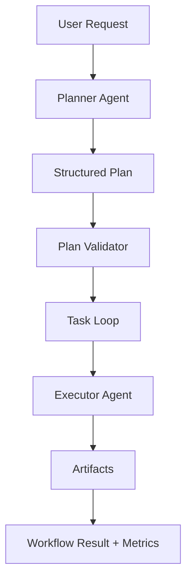

# Architecture

## System Overview

The system is a two-agent onboarding assistant built around a strict Planner -> Executor separation:

- The Planner converts one natural-language request into a structured plan.
- The Executor consumes one task at a time and generates one artifact per task.
- The Workflow coordinates both agents, validates data, collects metrics, and reports completion.
- The LLM factory centralizes provider, model, API key, and base URL creation so switching providers does not require agent rewrites.
- The command-line interface (`main.py`) provides an interactive prompt for user requests and formats the JSON results into human-readable text.



## Responsibilities

### Planner Responsibilities

- Accept exactly one natural-language request.
- Produce a structured onboarding plan.
- Keep all artifact generation out of scope.
- Preserve task ordering and dependency information.

### Executor Responsibilities

- Accept exactly one task at a time.
- Generate exactly one artifact for that task.
- Never perform planning.
- Use the task context and original request only as execution input.

### Workflow Responsibilities

- Run the planner once.
- Run the executor once per task.
- Validate the plan before execution begins.
- Validate artifacts after generation.
- Collect execution metrics.
- Convert failures into controlled application exceptions.

## Technology Stack

- Python 3.11
- LangChain
- ChatOllama
- ChatGoogleGenerativeAI
- ChatOpenAI
- python-dotenv
- Pydantic
- logging
- pytest

## Component Descriptions

### `warehouse_assistant.models`

Defines structured data contracts for tasks, plans, artifacts, metrics, and final workflow results.

### `warehouse_assistant.llm_factory`

Creates provider-specific chat model clients from shared configuration.

### `warehouse_assistant.agents.planner`

Encapsulates planning logic and prompt construction for the Planner Agent.

### `warehouse_assistant.agents.executor`

Encapsulates task-level artifact generation for the Executor Agent.

### `warehouse_assistant.utils.validator`

Validates task graphs and artifact payloads before they move deeper into the workflow.

### `warehouse_assistant.workflow`

Coordinates the end-to-end flow and measures execution timing.

## Project Structure

```text
main.py
warehouse_assistant/
  config.py
  exceptions.py
  llm_factory.py
  logging_config.py
  metrics.py
  models.py
  agents/
    __init__.py
    executor.py
    planner.py
  prompts/
    __init__.py
    prompts.py
  utils/
    validator.py
  workflow.py
docs/
  architecture.md
  prompts.md
  workflow.md
tests/
```

## Separation of Concerns

The project intentionally keeps the planning and execution responsibilities separate so that:

- planner changes do not affect artifact generation behavior,
- executor changes do not alter task planning behavior,
- validation can be reasoned about independently,
- tests can isolate each component with simple mocks.
