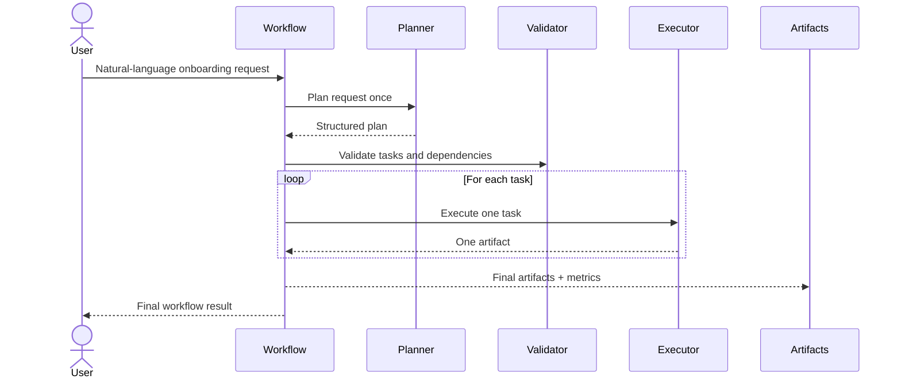

# Workflow

## End-to-End Flow

## Stage-by-Stage Explanation

### 1. User Request

The user submits one onboarding request in natural language.

### 2. Planner

The Planner converts the request into a structured plan with tasks and dependencies. It does not produce artifacts.

### 3. Structured Plan

The plan is validated to ensure task identifiers are unique, dependencies exist, and no cycles are present.

### 4. Loop Tasks

Each task is processed sequentially so the executor receives exactly one task at a time.

### 5. Executor

The Executor generates one artifact for the current task and returns it to the workflow.

### 6. Artifacts

Artifacts are validated and collected in task order.

### 7. Final Output

The workflow returns the complete plan, generated artifacts, and execution metrics. The command-line interface (`main.py`) then formats these results into a human-readable text summary for the user.
